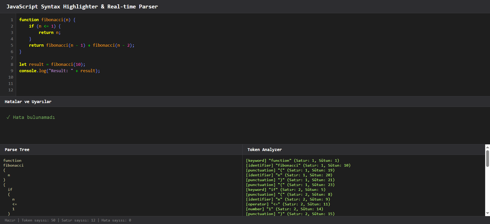
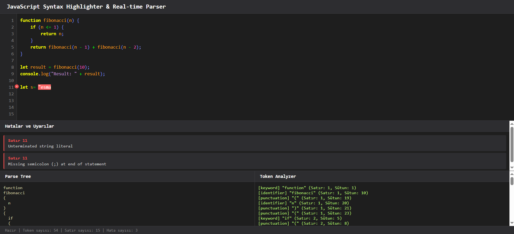
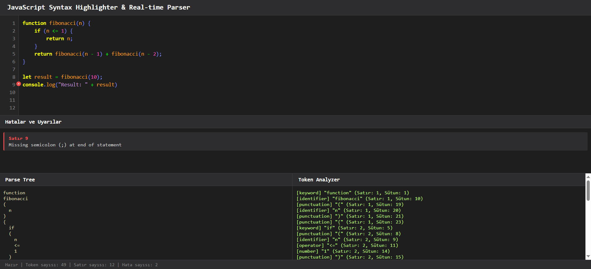
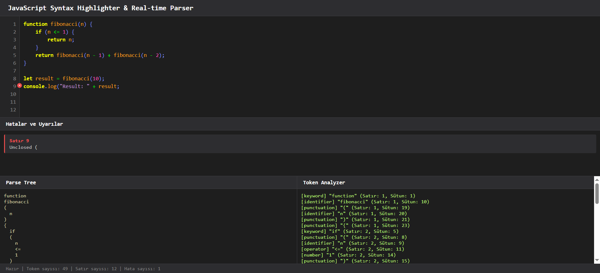
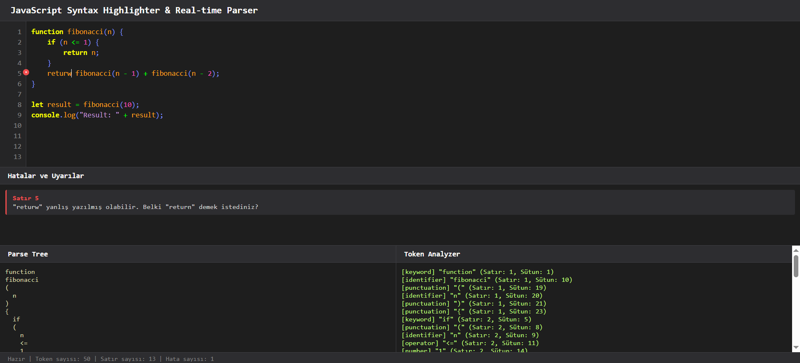

# 🚀 JavaScript Kod Editörü ve Sözdizimi Vurgulayıcı

Bu proje, **JavaScript, HTML5 ve CSS** kullanılarak geliştirilmiş bir web tabanlı kod editörüdür. Canlı sözdizimi vurgulama, hata yakalama ve gerçek zamanlı geri bildirim ile kodları çalıştırmaya yarayan bir uygulamadır.

---

## 🚀 Canlı Demo

Uygulamayı canlı olarak deneyimlemek için buraya tıklayın:  
👉 [Canlı Demo](https://esmabilen37.github.io/js-syntax-highlighter/)

---

## 🔧 Kullanılan Teknolojiler

- **JavaScript (ES6+)**  
- **HTML5**  
- **CSS3**

---

## ✨ Özellikler

- Canlı sözdizimi vurgulama  
- Lexical ve Syntax analiz  
- Satır numaraları ve hata göstergeleri  
- Hata listesi  
- Parse ağacı ve token listesi  
- Kaydırma senkronizasyonu  
- Kullanıcı dostu arayüz  

---

## 🎨 Token Renkleri (Sözdizimi Vurgulama Teması)

| Token Türü               | CSS Sınıfı           | Renk Açıklaması                     | Renk Kodu                        |
| ------------------------ | -------------------- | ----------------------------------- | -------------------------------- |
| **Anahtar Kelime**       | `.token-keyword`     | Parlak sarı                         | `#f6ff00`                        |
| **String (Metin)**       | `.token-string`      | Açık mor                            | `#e2abffd0`                      |
| **Sayı**                 | `.token-number`      | Parlak pembe                        | `#f950b8`                        |
| **Yorum Satırı**         | `.token-comment`     | Parlak camgöbeği, italik            | `#2efcff`                        |
| **Tanımlayıcı**          | `.token-identifier`  | Turuncu-sarı tonu                   | `#ffa01b`                        |
| **Operatörler**          | `.token-operator`    | Canlı yeşil                         | `#00ff04`                        |
| **Noktalama İşaretleri** | `.token-punctuation` | Mavi-mor tonu                       | `#7c8dff`                        |
| **Fonksiyon İsimleri**   | `.token-function`    | Soluk sarı                          | `#dcdcaa`                        |
| **Hatalı Alanlar**       | `.token-error`       | Kırmızı arka plan, beyaz yazı rengi | `#ff6666` (bg), `#ffffff` (text) |

---

## 🖼️ Proje Görselleri

### İlk Durum  
  

### Örnek Hatalar  
  
  
  

### Tahmin Etme Mekanizması  


---

## 💻 Proje Yapısı

- `index.html`  
- `style.css`  
- `LexicalAnalyzer.js`  
- `SyntaxAnalyzer.js`  
- `SyntaxHighlighter.js`

---


## 🎯 Nasıl Çalışır?

1. Kullanıcı kod yazmaya başlar  
2. `LexicalAnalyzer` tokenlara ayırır  
3. `SyntaxAnalyzer` sözdizimini kontrol eder  
4. `SyntaxHighlighter` renklendirir ve hataları gösterir  
5. Tüm arayüz güncellemeleri yapılır  

---

## 🛠️ Teknik Detaylar

Uygulama, klasik bir **compiler front-end** mimarisine göre yapılandırılmıştır. Dört temel aşamada çalışır:

---

### 1️⃣ Lexical Analyzer (Sözcüksel Çözümleme)

- Kullanıcının yazdığı kaynak kod karakter karakter okunur.
- Kod, **token** adı verilen anlamlı parçalara ayrılır.
- Her token bir kategoriye atanır: `keyword`, `identifier`, `operator`, `number`, `string`, `punctuation`, `comment` vb.
- Geçersiz karakter dizileri için **token-error** sınıfı atanarak kullanıcıya bildirilir.

📂 İlgili dosya: `LexicalAnalyzer.js`

---

### 2️⃣ Syntax Analyzer (Parser / Sözdizimsel Çözümleme)

- Lexical analizden gelen token listesi alınır.
- Bu tokenlar, **EBNF** kurallarına göre kontrol edilir.
- Kurallara uymayan yapılar belirlenir ve açıklayıcı hata mesajları oluşturulur.
- Her ifadenin doğru yapıda olup olmadığı belirlenir.

📂 İlgili dosya: `SyntaxAnalyzer.js`

---

### 3️⃣ Token Sistemi ve Renklendirme

- Token'lar analizden sonra belirli sınıflarla işaretlenir:
  - `token-keyword`, `token-string`, `token-number`, `token-comment`, vb.
- Bu sınıflar CSS ile özelleştirilmiş renklerle vurgulanır.
- **Hatalı token'lar** özel bir arka plan rengiyle öne çıkarılır (`.token-error`).

📂 İlgili dosya: `SyntaxHighlighter.js`  
🎨 Renk tabloları için: [🎨 Token Renkleri](#-token-renkleri-sözdizimi-vurgulama-teması)

---

### 4️⃣ Parse Ağacı ve Token Listesi

- Kodun **parse (ayrıştırma) ağacı** oluşturulur ve kullanıcıya görsel olarak sunulur.
- Her bir token’ın türü, değeri ve satır bilgisi liste halinde gösterilir.


---

## 📝 Medium Makalesi

Uygulamanın geliştirilme süreci ve teknik detayları hakkında yazdığım Medium makalesine buradan ulaşabilirsiniz:  
👉 [Makale Linki](https://medium.com/@esmabilenn37/tarayıcıda-gerçek-zamanlı-sözdizimi-analizi-javascript-ile-geliştirilmiş-basic-kod-editörü-5cde67c96c97)

---
## 📽️ Tanıtım Videosu

Uygulamanın nasıl çalıştığını görmek isterseniz bu videoya göz atabilirsiniz:  
👉 [YouTube – Tanıtım Videosu](https://www.youtube.com/watch?v=VmXFRisqO1M)

---
## 🧠 Gramer Yapısı

EBNF ile temel JavaScript grameri bu şekilde:

```ebnf
program      = { statement } ;
statement    = varDecl | funcDecl | exprStmt ;
varDecl      = ("let" | "const" | "var") identifier "=" expression ";" ;
funcDecl     = "function" identifier "(" [ identifier { "," identifier } ] ")" block ;
exprStmt     = expression ";" ;
block        = "{" { statement } "}" ;
expression   = identifier | number | string | expression operator expression ;
identifier   = letter { letter | digit | "_" | "$" } ;
number       = digit { digit } ;
string       = '"' { any } '"' | "'" { any } "'" ;
operator     = "+" | "-" | "*" | "/" | "%" | "==" | "!=" | ... ;

